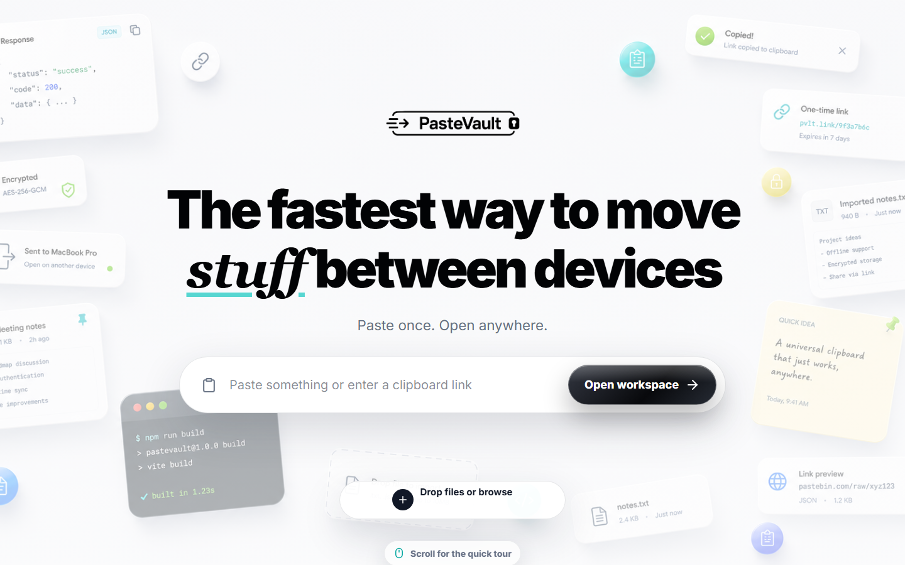

# PasteVault — stop texting yourself links

Paste once, open anywhere. A private clipboard for text, code, links and JSON that moves between your devices, encrypted before it leaves the browser.



No account. Your clipboard is a link. Lock it with a password and even the server only ever sees ciphertext.

**[Open PasteVault →](https://pastevault-lime.vercel.app)** · React · Vite · Web Crypto · Upstash Redis

---

## What it does

- **One link, one clipboard.** The first paste creates it; clips stay until you delete them
- **Copy in one tap**, read straight from the system clipboard, share a single clip by link
- **Import and export** text/code files and full JSON history, with per-file validation
- **Installable** as a PWA

## How the encryption works

Encryption happens in the browser with **AES-256-GCM**, before anything is synced.

- **Unlocked clipboards** are encrypted for sync with a key derived from the clipboard link id, so only someone with the link can read them.
- **Password-protected clipboards** derive the key from your password with **PBKDF2 (210,000 iterations)** and stay encrypted on the device too. The password never leaves the device.
- **Sync** stores the encrypted blob in Upstash Redis / Vercel KV. The API rejects anything that isn't an encrypted payload, and caps requests at 1 MB.

The server can route your data but can't read it.

## Run it

```bash
npm install
npm start          # http://localhost:4000
npm test
```

For cross-device sync, set `UPSTASH_REDIS_REST_URL` + `UPSTASH_REDIS_REST_TOKEN` (or `KV_REST_API_URL` + `KV_REST_API_TOKEN`). Without them it runs fully local.

## Built with

React, Vite, Tailwind CSS, Web Crypto API, Vercel Functions, Upstash Redis.

MIT © [Kingsley Aremu](https://github.com/iice257)
